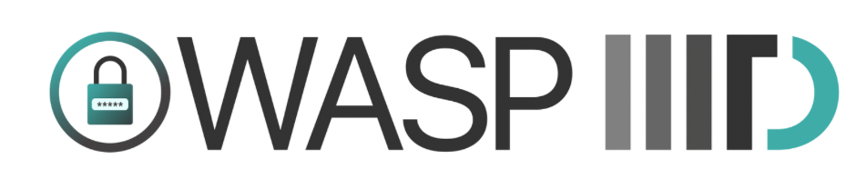

---

layout: col-sidebar
title: OWASP Indraprastha Institute of Information Technology
tags: iiitd, delhi
region: Asia
meetup-group: owasp-indraprastha-institute-of-information-technology

---

## Welcome

The OWASP IIITD Student Chapter was formed in 2022 with the aim of spreading awareness about cybersecurity and malware. We share the same goal as well as the motivation that OWASP shares. We welcome you all to OWASP IIITD Chapter.

## About OWASP IIITD
Our Aim and plan is to indulge in sharing our knowledge through CTF's , spreading cybersecurity awareness through our posts on social media, conducting meetups and events.We try to bring reputed speakers in the field of cybersecurity to share their insights and to keep the community updated.
With a Strength of more than 30 Members, Our organisation is broadly divided into Technical Team and Non Technical Team. The Non Technical Team has various departments in it (Design, Operations, Content, Web Development, Video Editing, Outreach,Finance). Each Member is assigned some roles and the member gives their best for development and growth of the chapter. The Technical Team consists of Members who are experienced in the field of Cybersecurity and have won numerous awards and gained several positions in the field.

## Participation
The Open Web Application Security Project (OWASP) is a nonprofit foundation that works to improve the security of software. All of our projects ,tools, documents, forums, and chapters are free and open to anyone interested in improving application security. 

Chapters are led by local leaders in accordance with the [Chapters Policy](/www-policy/operational/chapters). Financial contributions should only be made online using the authorized online donation button. 

Everyone is welcome and encouraged to participate in our [Projects](/projects/), [Local Chapters](/chapters/), [Events](/events/), [Online Groups](https://groups.google.com/a/owasp.com/){:target='_blank'}, and [Community Slack Channel](https://owasp.slack.com/){:target='_blank'}. We especially encourage diversity in all our initiatives. OWASP is a fantastic place to learn about application security, to network, and even to build your reputation as an expert. We also encourage you to be [become a member](/membership/) or consider a [donation](/donate/) to support our ongoing work.
 
## Upcoming Events <!-- You should keep this section as it will populate your meetup events -->
---------------------


For previous events, go to the "Events" tab.

